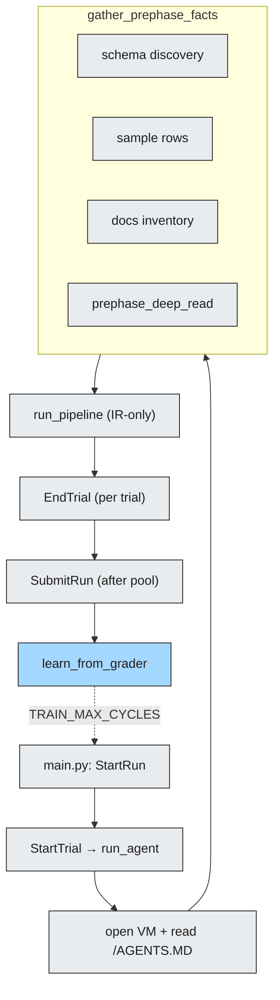
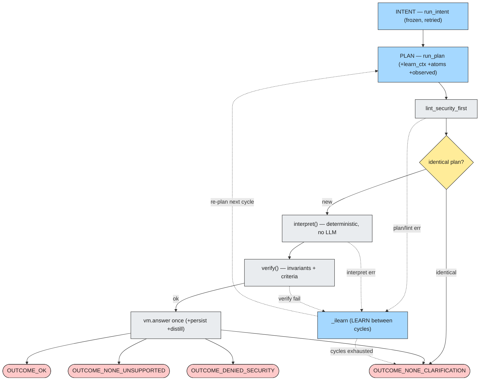
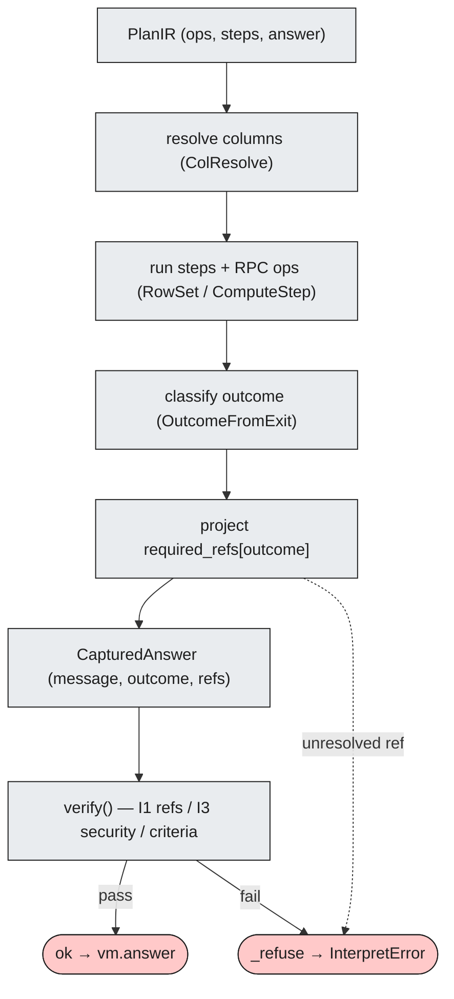
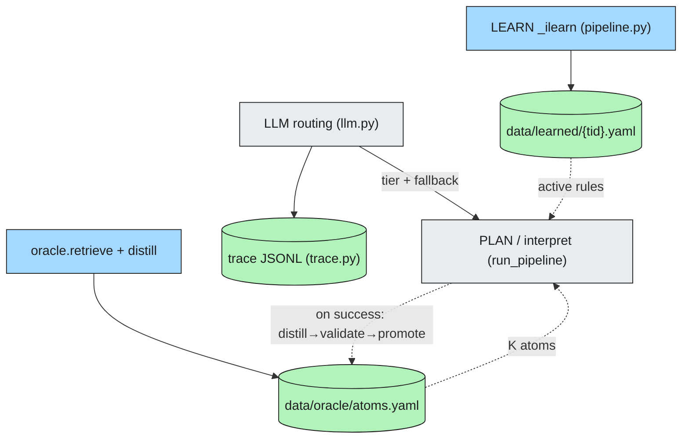
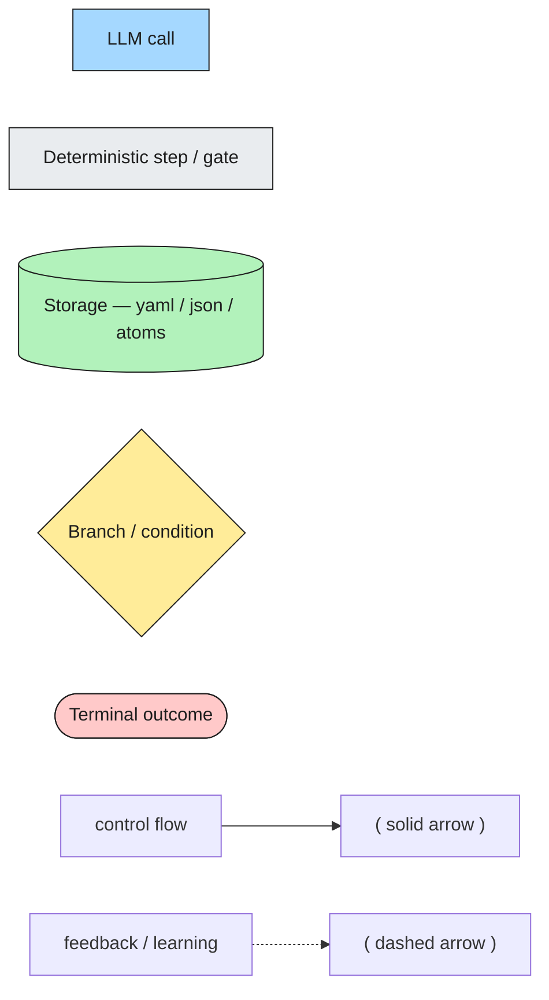

# Agent Architecture — Mermaid views

Clean, auto-routed companion to `agent-architecture.excalidraw` (same four diagrams +
legend). Mermaid's layered (dagre) layout removes the manual-placement crossings of the
Excalidraw canvas, so these blocks are the readable reference; the `.excalidraw` stays the
editable-in-app artifact. Renders on GitHub, Obsidian, and `mermaid.live`.

> **IR-only pipeline.** The legacy DESIGN→CODEGEN loop and the `INTERPRETER_ENABLED`
> fork were removed; `run_pipeline` is a single deterministic-interpreter path.

Shape/colour vocabulary (shared by every diagram):

| Glyph | Mermaid syntax | Meaning |
|-------|----------------|---------|
| Blue rectangle | `["…"]:::llm` | LLM call |
| Grey rectangle | `["…"]:::gate` | Deterministic step / gate |
| Green cylinder | `[("…")]:::store` | Storage (yaml / json / atoms) |
| Yellow diamond | `{"…"}:::branch` | Branch / condition |
| Red stadium | `(["…"]):::terminal` | Terminal outcome |
| `-->` | solid link | Control flow |
| `-.->` | dashed link | Feedback / learning |

## Diagram 1 — End-to-end flow (harness → pipeline)

## Diagram 2 — IR pipeline cycle + gates

## Diagram 3 — `interpret()` + `verify()` internals

## Diagram 4 — Cross-cutting subsystems

## Legend

