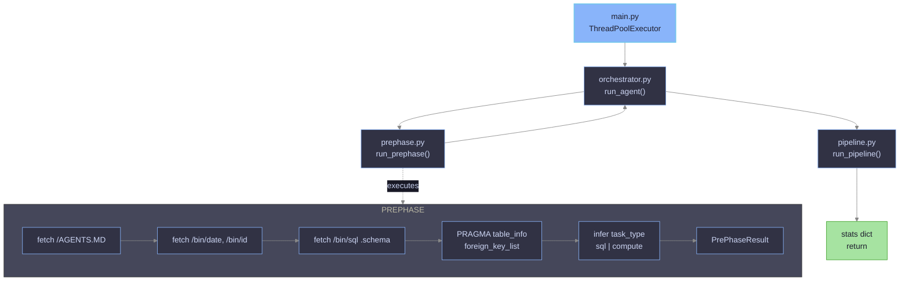
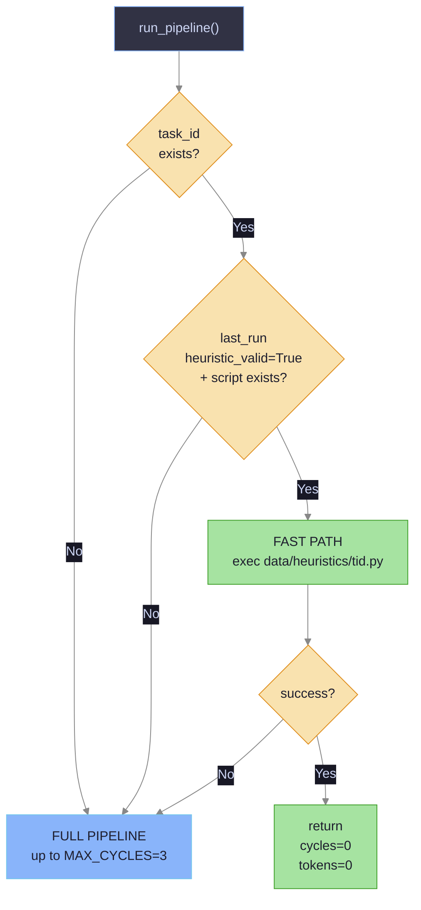
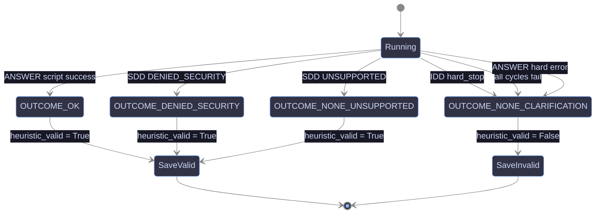
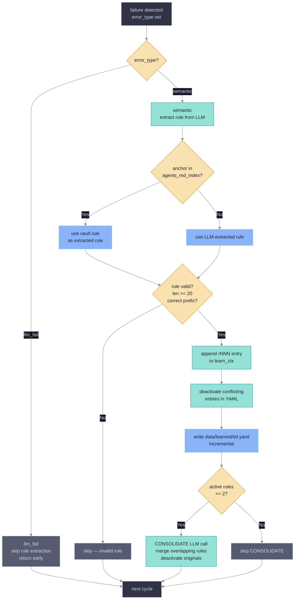
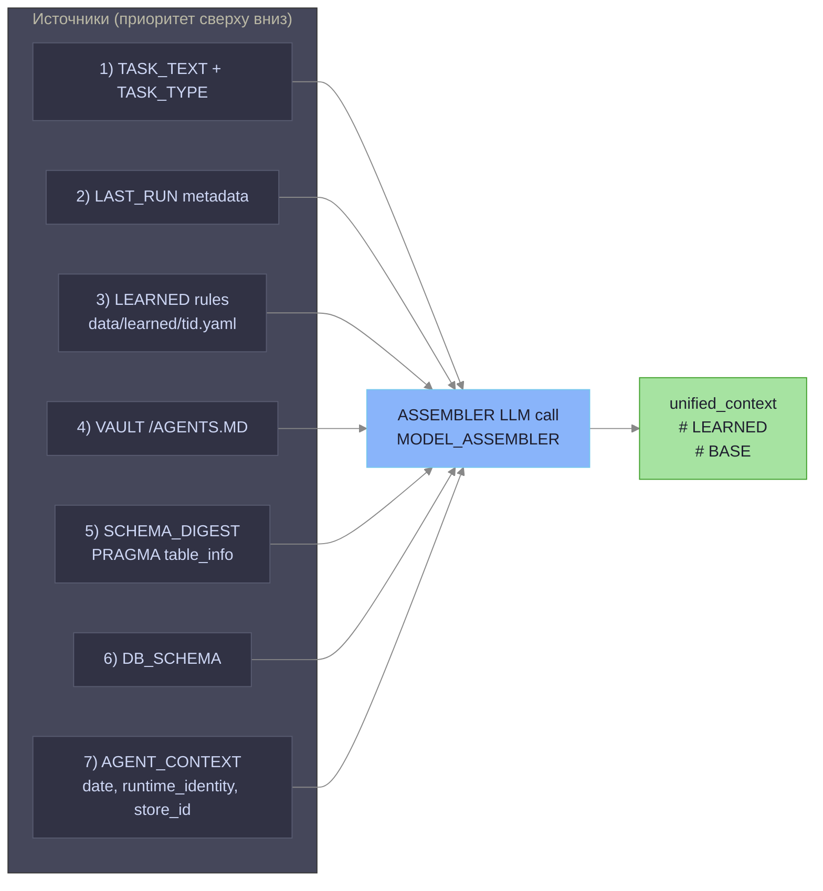
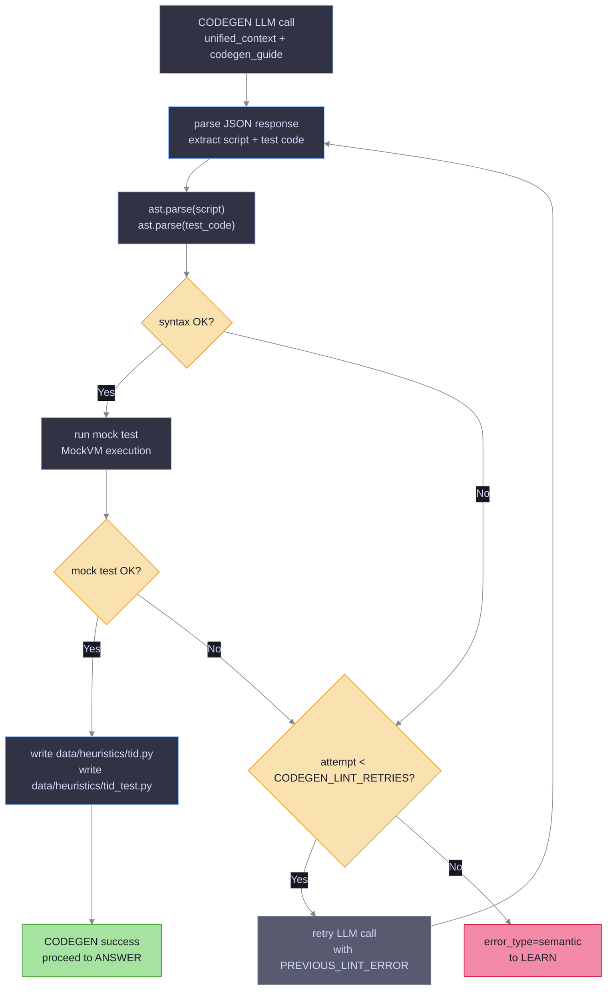
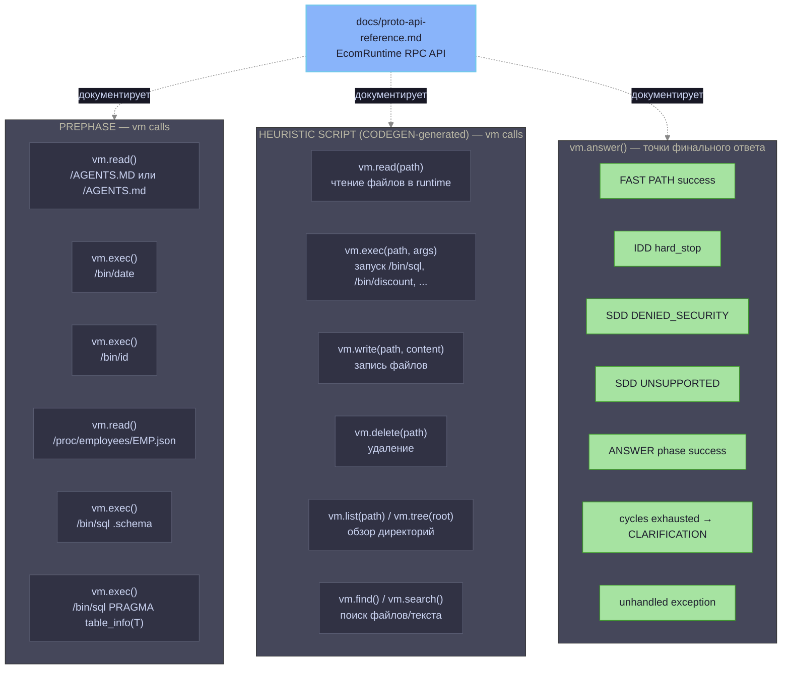

# Pipeline Flow — ecom1-agent

## 1. Общий поток агента

---

## 2. Fast Path vs Full Pipeline

---

## 3. Полный цикл пайплайна (один цикл из MAX_CYCLES)

```mermaid
%%{init: {'theme': 'base', 'themeVariables': {
  'background': '#1e1e2e',
  'primaryColor': '#313244',
  'primaryTextColor': '#cdd6f4',
  'primaryBorderColor': '#89b4fa',
  'lineColor': '#888888',
  'secondaryColor': '#181825',
  'tertiaryColor': '#45475a'
}}}%%
flowchart TD
    CYCLE_START["Цикл N / MAX_CYCLES"]

    ASSEMBLE["ASSEMBLE\nprompt_assembler.py\n1x LLM call"]
    IDD["IDD\nIntent Detection\n1x LLM call"]
    IDD_HARD{"hard_stop?"}
    IDD_FAIL{"parse fail?"}

    SDD["SDD\nSpec Design\n1x LLM call"]
    SDD_SEC{"DENIED_SECURITY?"}
    SDD_UNS{"UNSUPPORTED?"}
    SDD_FAIL{"parse fail?"}

    PLAN["PLAN\nAction selection\n1x LLM call"]
    PLAN_EMPTY{"action\nempty?"}
    PLAN_RETRY{"retry loop\ndetected?"}
    PLAN_INJ["inject issuer_id\ninject store_id filter"]

    CODEGEN["CODEGEN\ngenerate heuristic script\n1x LLM call"]
    LINT_LOOP["lint retry loop\nup to CODEGEN_LINT_RETRIES=3"]
    LINT_OK{"ast.parse\nOK + mock test OK?"}
    LINT_FAIL{"max retries\nreached?"}

    ANSWER["ANSWER\nexec script on real VM\n0x LLM call"]
    ANS_HARD{"hard error\n_HARD_ERROR_PREFIX?"}
    ANS_SOFT{"soft error?"}
    ANS_OK["SUCCESS\noutcome from script"]

    LEARN["LEARN\n1x LLM call\nappend rule to learn_ctx"]
    CONSOLIDATE["CONSOLIDATE\n1x LLM call if 2+ rules\nmerge overlapping rules"]
    NEXT_CYCLE["next cycle\nor exhaust"]

    HARD_STOP_ANS["vm.answer()\nhard_stop code\nbreak SUCCESS"]
    SEC_ANS["vm.answer()\nDENIED_SECURITY\nbreak SUCCESS"]
    UNS_ANS["vm.answer()\nUNSUPPORTED\nbreak SUCCESS"]
    HARD_ERR_BREAK["break loop\nno success"]
    SUCCESS_BREAK["vm.answer()\nbreak SUCCESS"]

    CYCLE_START --> ASSEMBLE --> IDD
    IDD --> IDD_HARD
    IDD_HARD -- Yes --> HARD_STOP_ANS
    IDD_HARD -- No --> IDD_FAIL
    IDD_FAIL -- Yes --> LEARN

    IDD_FAIL -- No --> SDD
    SDD --> SDD_SEC
    SDD_SEC -- Yes --> SEC_ANS
    SDD_SEC -- No --> SDD_UNS
    SDD_UNS -- Yes --> UNS_ANS
    SDD_UNS -- No --> SDD_FAIL
    SDD_FAIL -- Yes --> LEARN

    SDD_FAIL -- No --> PLAN
    PLAN --> PLAN_EMPTY
    PLAN_EMPTY -- Yes --> LEARN
    PLAN_EMPTY -- No --> PLAN_RETRY
    PLAN_RETRY -- Yes --> LEARN
    PLAN_RETRY -- No --> PLAN_INJ --> CODEGEN

    CODEGEN --> LINT_LOOP --> LINT_OK
    LINT_OK -- No --> LINT_FAIL
    LINT_FAIL -- No --> LINT_LOOP
    LINT_FAIL -- Yes --> LEARN
    LINT_OK -- Yes --> ANSWER

    ANSWER --> ANS_HARD
    ANS_HARD -- Yes --> HARD_ERR_BREAK
    ANS_HARD -- No --> ANS_SOFT
    ANS_SOFT -- Yes --> LEARN
    ANS_SOFT -- No --> ANS_OK --> SUCCESS_BREAK

    LEARN --> CONSOLIDATE --> NEXT_CYCLE

    classDef phase    fill:#313244,color:#cdd6f4,stroke:#89b4fa
    classDef decision fill:#f9e2af,color:#1e1e2e,stroke:#df8e1d
    classDef success  fill:#a6e3a1,color:#1e1e2e,stroke:#40a02b
    classDef danger   fill:#f38ba8,color:#1e1e2e,stroke:#d20f39
    classDef learn    fill:#94e2d5,color:#1e1e2e,stroke:#179299
    classDef inject   fill:#585b70,color:#cdd6f4,stroke:#6c7086

    class ASSEMBLE,IDD,SDD,PLAN,CODEGEN,ANSWER phase
    class IDD_HARD,IDD_FAIL,SDD_SEC,SDD_UNS,SDD_FAIL,PLAN_EMPTY,PLAN_RETRY,LINT_OK,LINT_FAIL,ANS_HARD,ANS_SOFT decision
    class HARD_STOP_ANS,SEC_ANS,UNS_ANS,ANS_OK,SUCCESS_BREAK success
    class HARD_ERR_BREAK danger
    class LEARN,CONSOLIDATE learn
    class PLAN_INJ,LINT_LOOP inject
```

---

## 4. Состояния исхода и heuristic_valid

---

## 5. LEARN и CONSOLIDATE — логика обучения

---

## 6. Сборка контекста (ASSEMBLE)

---

## 7. CODEGEN — внутренний lint-цикл

---

## 8. VM API (proto-api-reference.md) — точки вызова в пайплайне

> Все RPC задокументированы в `docs/proto-api-reference.md` (источник: `proto/bitgn/vm/ecom/ecom.proto`).

### Сводка: какой RPC где используется

| RPC | Фаза | Что вызывает |
|-----|------|-------------|
| `Read` | PREPHASE | `/AGENTS.MD`, `/proc/employees/EMP.json` |
| `Read` | HEURISTIC | произвольные файлы runtime |
| `Exec` | PREPHASE | `/bin/date`, `/bin/id`, `/bin/sql .schema`, `/bin/sql PRAGMA` |
| `Exec` | HEURISTIC | `/bin/sql`, `/bin/discount`, прочие runtime-tools |
| `Write` | HEURISTIC | запись данных в runtime |
| `Delete` | HEURISTIC | удаление файлов |
| `List` / `Tree` | HEURISTIC | обзор директорий |
| `Find` / `Search` | HEURISTIC | поиск по имени / regex |
| `Answer` | FAST PATH, IDD, SDD, ANSWER, CLARIFICATION | финальный ответ хaрнессу |
| `Context` | — | **Deprecated**, не используется |

---

## 9. Таблица фаз — LLM-вызовы и выходные данные

| Фаза | LLM-вызов | Модель | Выходные данные | Ошибка → |
|------|-----------|--------|-----------------|----------|
| ASSEMBLE | 1x | MODEL_ASSEMBLER | unified_context | — |
| IDD | 1x | MODEL | IddOutput (decision, intent, params) | LEARN(llm_fail/semantic) |
| SDD | 1x | MODEL_SDD | SddOutput (actions, error_code) | LEARN(llm_fail/semantic) |
| PLAN | 1x | MODEL_PLAN | PlanOutput (action anchor) | LEARN(semantic) |
| CODEGEN | 1x + retries | MODEL_CODEGEN | heuristic script .py | LEARN(semantic) |
| ANSWER | 0x | — | outcome, answer | LEARN(semantic) / break |
| LEARN | 1x | MODEL_LEARN | rule → learn_ctx | — |
| CONSOLIDATE | 0–1x | MODEL_CONSOLIDATE | merged rules | — |
