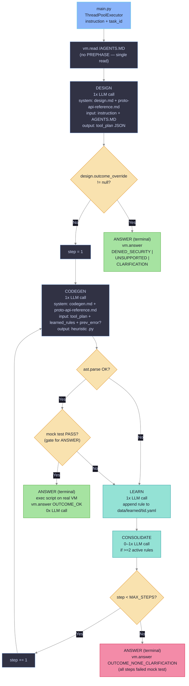

# Intent: Pipeline Redesign — DESIGN + CODEGEN Two-Phase Architecture

**Date:** 2026-05-28
**Status:** draft

## Objective

Current pipeline (PREPHASE + ASSEMBLE + IDD + SDD + PLAN + CODEGEN + ANSWER) requires ≥6 LLM calls per first cycle and fails first-cycle success too often. Heuristic code quality is low: the agent does not use the full `EcomRuntime` vm API surface (relies on `vm.exec /bin/sql` only, ignores `List`/`Tree`/`Find`/`Search`/`Stat`), and does not follow explicit AGENTS.MD task instructions.

Redesign target: collapse intent/spec/plan reasoning into a single deterministic DESIGN phase grounded in `docs/proto-api-reference.md`, then iterate only on CODEGEN (the part that actually needs to learn). Goal: every benchmark task solved in one run under one hour wall-clock with parallelism.

## New Pipeline Flow

### Key differences vs current pipeline

| Aspect | Current | New |
|--------|---------|-----|
| Pre-task setup | PREPHASE (6+ vm calls: AGENTS.MD, date, id, schema, PRAGMA) | Single `vm.read /AGENTS.MD` |
| Context assembly | ASSEMBLE phase (1x LLM) | None — DESIGN reads inputs directly |
| Reasoning phases | IDD + SDD + PLAN (3x LLM, sequential) | DESIGN (1x LLM, JSON output) |
| Retry boundary | Outer cycle (MAX_STEPS=3) + inner CODEGEN lint loop (CODEGEN_LINT_RETRIES=3) | Single unified counter; mock test = gate, ANSWER is terminal one-shot outside loop |
| LEARN scope | Modifies subsequent ASSEMBLE/IDD/SDD/PLAN/CODEGEN | Modifies CODEGEN only; DESIGN frozen per task run |
| Fast path | `data/heuristics/{tid}.py` executed if `heuristic_valid=True` | Removed; every run = full DESIGN → CODEGEN |
| Best-case LLM calls | ≥6 (ASSEMBLE+IDD+SDD+PLAN+CODEGEN; ANSWER 0x) | 2 (DESIGN + CODEGEN_1) |
| Worst-case LLM calls | ASSEMBLE+IDD+SDD+PLAN+CODEGEN+LEARN × 3 cycles ≈ 18+ | DESIGN + 3×(CODEGEN+LEARN) = 7 |

## Desired Outcomes

- **OC1.** First-cycle success rate (`step=1` in CODEGEN loop) grows from current baseline toward majority of benchmark tasks
- **OC2.** Generated heuristic scripts use the full vm API surface: `List`/`Tree`/`Find`/`Search`/`Stat`/`Read` for discovery, not just `Exec /bin/sql`
- **OC3.** Heuristic scripts enforce AGENTS.MD rules in-code with fail-fast checks (`issuer_id`, `store_id` filter, etc.)
- **OC4.** Mean LLM calls per task drops from current ≥6 toward 2 (DESIGN + CODEGEN_1) on best case, ≤7 on worst case (MAX_STEPS=3)
- **OC5.** All benchmark tasks complete successfully in a single benchmark run

## Health Metrics

- **HM1.** Accuracy on already-learned tasks (`t01.yaml`, `t99.yaml`) does not regress after refactor
- **HM3.** LEARN mechanism continues incremental writes to `data/learned/{tid}.yaml`
- **HM4.** SQL-security guards (`check_retry_loop` in `sql_security.py`, JSON extraction priority in `json_extract.py`) remain intact
- **HM5.** Per-task token cost (input + output × tier price) does not grow as quality grows
- **HM6.** All LLM tier integrations remain functional: `anthropic/`, `openrouter/`, `ollama/`, `claude-code`
- **HM7.** Heuristic chooses the cheapest-token + fastest vm tool that yields a correct result (e.g. `vm.find` over `vm.tree` + manual parse; `vm.read` with line range over full-file read)

## Strategic Context

- **Interacts with:**
  - `harness` (BitGN, `main.py` ThreadPoolExecutor) — provides `instruction` + `task_id`, awaits `vm.answer()`
  - `EcomRuntime` vm — full RPC surface in `proto/bitgn/vm/ecom/ecom.proto`
  - LLM providers via `agent/llm.py` — `anthropic`/`openrouter`/`ollama`/`claude-code` tiers with fallback
  - `/AGENTS.MD` vault rules (sole source of task-specific instructions, replaces PREPHASE schema introspection)
  - Persistence: `data/learned/{tid}.yaml` (CODEGEN-specific rules), `data/heuristics/{tid}.py` (last-attempt reference)
- **Priority trade-off:** `trust = speed > cost`. Correctness and wall-clock budget (≤1 h benchmark) co-equal; token spend secondary.
- **Removed:** `data/eval_log.jsonl` (legacy, no consumer)

## Constraints

### Steering (behavioral guidance)

- **S1.** Generated heuristic discovers before acting — `vm.list/tree/find/stat` first, then `vm.exec` / `vm.write` — no path guessing
- **S2.** Heuristic reads AGENTS.MD rules and applies them verbatim, no LLM reinterpretation at execution time
- **S3.** Minimize vm calls inside heuristic: batch with CTEs in one `vm.exec /bin/sql`, use `Read` line ranges, prefer `Find`/`Search` over `Tree` + manual parse
- **S4.** Phase guides in `data/prompts/*.md` contain only generic structural rules; task-specific knowledge flows only through LEARN → `data/learned/{tid}.yaml`

### Hard (architectural enforcement)

- **H1.** Delete `agent/prephase.py` and the `PrePhaseResult` data class entirely
- **H2.** DESIGN input = `[instruction, /AGENTS.MD content]` only (no schema_digest, no agents_md_index, no last_run scraping for input)
- **H3.** `docs/proto-api-reference.md` is a mandatory prompt-context appendix for both DESIGN and CODEGEN
- **H4.** Forbidden to patch `data/prompts/*.md` to fix a specific task — fix LEARN trigger or learned rule instead
- **H5.** Preserve SQL-security guards: `check_retry_loop` in `agent/sql_security.py`, JSON extraction priority in `agent/json_extract.py`
- **H6.** ~~FAST PATH preserved~~ — **REMOVED.** Every run executes full DESIGN → CODEGEN pipeline (task instructions vary per run, cached heuristic is not safe to replay blindly)
- **H7.** Delete `data/eval_log.jsonl` plus all writer code paths
- **H8.** `vm.answer()` remains the only final-response RPC
- **H9.** `docs/proto-api-reference.md` is prompt-base for DESIGN and CODEGEN system prompts
- **H10.** IDD + SDD + PLAN collapse into single **DESIGN** phase (one LLM call, structured JSON output: `intent`, `params`, `success_criteria`, `outcome_override`, `tool_plan`, `anchors`)
- **H11.** DESIGN emits `tool_plan` — ordered sequence of vm RPC invocations; CODEGEN translates `tool_plan` to a Python heuristic script
- **H12.** No ASSEMBLE phase. Delete `agent/prompt_assembler.py` and `data/prompts/assembler.md`
- **H13.** DESIGN input strictly `[instruction, AGENTS.MD content]`; system prompt = `data/prompts/design.md` + `docs/proto-api-reference.md`
- **H14.** CODEGEN input = `[tool_plan JSON, learned_rules from data/learned/{tid}.yaml, previous_lint_error?]`; system prompt = `data/prompts/codegen.md` + `docs/proto-api-reference.md`
- **H15.** LEARN feedback feeds back **only into CODEGEN**. DESIGN treats each invocation as fresh from `(instruction, agents.md)`. DESIGN does not change across retries within one task run.
- **H16.** `data/learned/{tid}.yaml` semantics shift to CODEGEN-knowledge: heuristic-generation patterns, common translation errors, vm-tool selection anchors
- **H17.** Every task = full pipeline. `heuristic_valid` flag removed. `data/heuristics/{tid}.py` is written as last-attempt reference for LEARN context, not executed pre-DESIGN
- **H18.** `CODEGEN_LINT_RETRIES` unified with `MAX_STEPS`. One retry counter wraps `[CODEGEN → ast.parse → mock test]`. Any failure on any step → LEARN → next step. **ANSWER lives outside the retry loop** as terminal one-shot.
- **H19.** **Mock test pass = gate for ANSWER.** Only after mock test succeeds the heuristic is executed on the real VM and `vm.answer()` is called. `vm.answer()` closes the task irreversibly — never invoke it speculatively. If all `MAX_STEPS` exhaust without a passing mock test, terminate with `vm.answer(OUTCOME_NONE_CLARIFICATION)`. LEARN never fires after `vm.answer()`.

## Autonomy Zones

- **Full autonomy** (reversible, low risk):
  - Create/edit `agent/design.py` (new phase)
  - Delete `agent/prephase.py`, `agent/prompt_assembler.py`
  - Remove FAST PATH branch from `agent/pipeline.py`
  - Edit `data/prompts/design.md`, `data/prompts/codegen.md`
  - Delete `data/eval_log.jsonl` and writer code
  - Update tests under `tests/*` for the new flow
- **Guarded** (log + confidence threshold):
  - None — all in-scope decisions either fully autonomous or proposal-first
- **Proposal-first** (needs approval):
  - Change `data/learned/{tid}.yaml` schema/format
  - Edit `models.json`
- **No autonomy** (human only):
  - `agent/llm.py` tier routing / fallback logic
  - `agent/sql_security.py` security guards
  - `bitgn/` generated proto stubs
  - `proto/` source proto files

## Stop Rules

- **Halt if:** accuracy on `t01.yaml` or `t99.yaml` regresses after refactor (learned tasks must remain green)
- **Halt if:** full benchmark wall-clock exceeds 1 hour with `ThreadPoolExecutor` parallelism
- **Escalate if:** DESIGN cannot produce a correct `tool_plan` for a task without LEARN feedback — would require reopening H15 (DESIGN-learning loop)
- **Escalate if:** implementation requires touching `bitgn/`, `proto/`, `agent/llm.py`, `agent/sql_security.py`, or `models.json`
- **Done when:**
  - All benchmark tasks solve in a single run under 1 hour wall-clock
  - OC1–OC5 achieved (first-cycle success majority, full vm API coverage, AGENTS.MD enforcement, mean LLM calls ≤2 best / ≤7 worst, all tasks pass)
  - HM1, HM3–HM7 hold (no regression on learned tasks, LEARN intact, security guards intact, costs do not grow, tier coverage intact, tool selection optimal)
